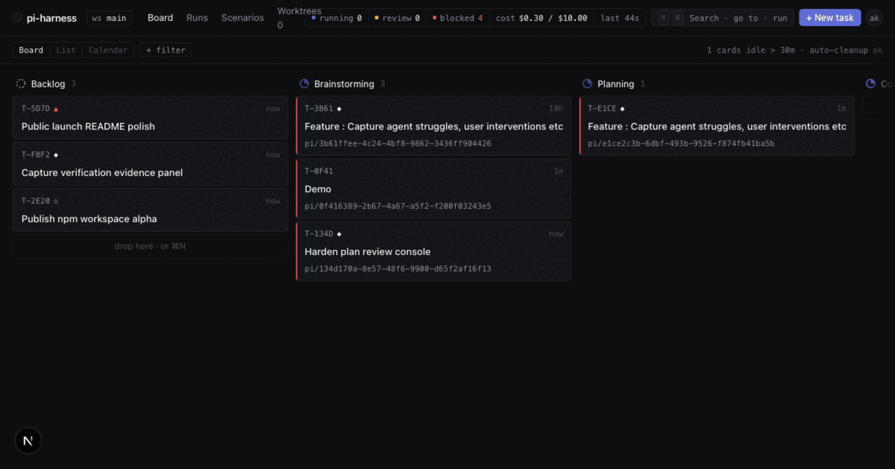
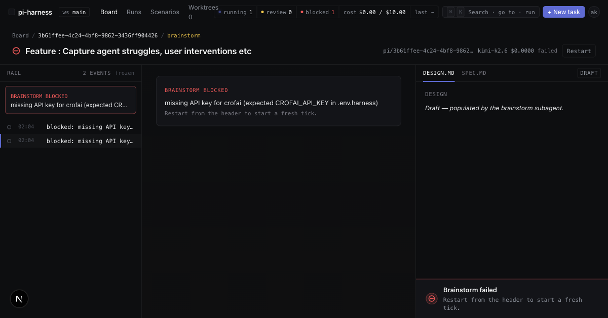
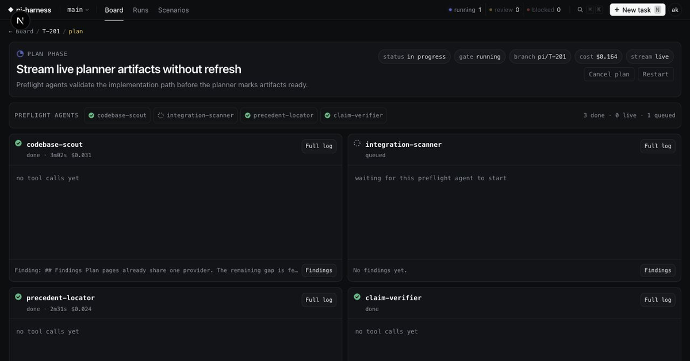
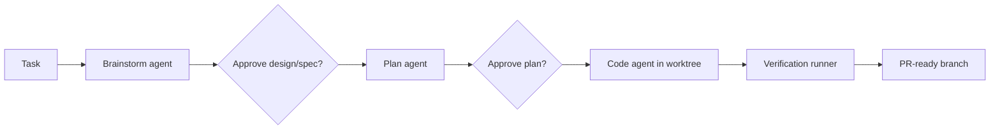

<div align="center">
  

  <p>
    <strong>The local command center for multi-agent coding runs.</strong><br>
    Turn a rough task into a brainstormed spec, reviewed plan, isolated worktree,
    and implementation-ready branch.
  </p>

  <p>
    <a href="#quickstart">Quickstart</a> ·
    <a href="#why-pi-harness">Why pi-harness</a> ·
    <a href="#dashboard-preview">Dashboard</a> ·
    <a href="#architecture">Architecture</a> ·
    <a href="#contributing">Contributing</a>
  </p>

  <p>
    
    
    
    
  </p>
</div>

---

pi-harness is a local orchestration layer for serious agentic coding work. It sits
between a human and a set of pi-powered coding agents, keeps every task in a
visible phase chain, and makes the moments that need judgment explicit.

Most coding agents stop at chat. pi-harness turns the work into a visible
delivery pipeline: **brainstorm -> plan -> code -> verify -> PR**.

## Why pi-harness

- **Spec-first agent work** - start from a rough task and get a structured
  brainstorm, design, and implementation plan before code starts moving.
- **Human approval gates** - pause at the places where intent matters instead
  of letting an agent barrel through a bad assumption.
- **Isolated execution** - agent runs happen in per-task git worktrees on
  dedicated branches, keeping your main checkout calm.
- **Live operational dashboard** - watch phase status, transcripts, artifacts,
  costs, files touched, and verification evidence from one board.
- **Local-first runtime** - runs against your repo, your container runtime, and
  your model/provider credentials.
- **Composable pi bridge** - wraps the pi coding-agent SDK so phase agents,
  prompt registries, and custom tools can evolve independently.

## Quickstart

Install the CLI and initialize pi-harness inside an existing git repository:

```bash
npm install -g @pi-harness/cli
pi-harness init
```

Add provider keys:

```bash
cp .env.harness.example .env.harness
# Fill CROFAI_API_KEY. Agent phases and Graphify use CrofAI by default.
```

Start the local runtime:

```bash
pi-harness dev
```

`pi-harness dev` runs `doctor`, starts optional local search infrastructure
when configured, starts the orchestrator, and opens the dashboard at
`http://localhost:3000`.

You can also run without a global install:

```bash
npx @pi-harness/cli init
npx @pi-harness/cli dev
```

## Dashboard Preview

### Board

The board keeps the whole pipeline visible without turning the UI into a log
dump.


### Brainstorm

Brainstorm runs produce design/spec artifacts and stop for review when the
agent has enough context.



### Plan

The planning surface shows agent findings, raw plan output, artifact diffs, and
approval controls in one place.



## How It Works



Each run gets a branch and worktree. Phase artifacts are persisted to disk and
mirrored into the dashboard event stream. If a phase fails, the task stays on
the board for human triage instead of disappearing into terminal scrollback.

## Architecture

| Layer | What it does |
| --- | --- |
| `@pi-harness/cli` | Bootstraps a repo, checks local prerequisites, starts the dev runtime. |
| `apps/dashboard` | Next.js dashboard for the board, task details, phase artifacts, and evidence. |
| `apps/orchestrator` | Fastify service that owns tasks, phase transitions, runs, SSE, and worktrees. |
| `@pi-harness/pi-bridge` | Provider/model registration and pi agent-session integration. |
| `@pi-harness/subagents` | Prompt registry and phase-agent definitions. |
| `@pi-harness/shared` | Shared schemas, config, and TypeScript domain types. |

Runtime control-plane state is stored as append-only JSONL ledgers under
`.harness/store/` in the configured harness state directory. Phase transcripts
remain in the existing per-task `.harness/<taskId>/*.jsonl` logs and archived
run folders.

## Local Development

For contributors working on this monorepo:

```bash
corepack enable
pnpm install
pnpm dev
```

Useful checks:

```bash
pnpm typecheck
pnpm lint
pnpm test
pnpm build
pnpm audit:maintainability
```

The dashboard E2E suite uses Playwright:

```bash
pnpm --filter @pi-harness/dashboard test:e2e
```

## Configuration

`pi-harness init` writes:

- `harness.config.ts`
- `.env.harness.example`
- `.harness/runtime/compose.yml`
- `.harness/README.md`
- `.harness/` in `.gitignore`

The generated config prefers Podman and records Docker only when Podman is not
available. Agent work runs in `.harness/worktrees/<taskId>` on branches named
`pi/<taskId>`.

## Troubleshooting

- **Missing Podman:** install/start Podman, or install Docker and rerun
  `pi-harness init`.
- **Missing API key:** copy `.env.harness.example` to `.env.harness` and fill
  `CROFAI_API_KEY`. Override `GRAPHIFY_*` only when routing Graphify through
  another OpenAI-compatible endpoint.
- **Port conflict:** set `dashboardPort` or `orchestratorPort` in
  `harness.config.ts`.
- **Non-main base branch:** edit `baseBranch` in `harness.config.ts`; worktrees
  are created from that branch.
- **Dry setup check:** run `pi-harness dev --check-only` to validate config
  without starting services.

## Contributing

Issues and PRs are welcome. Start with [CONTRIBUTING.md](CONTRIBUTING.md) for
setup, checks, and pull-request expectations.

## License

MIT. See [LICENSE](LICENSE).
