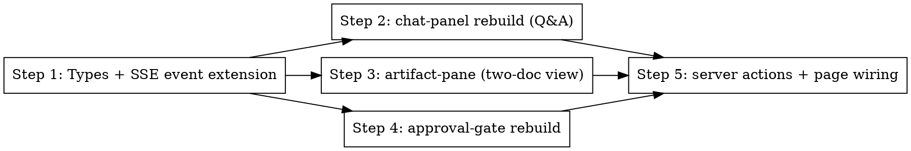

# Phase 5: Dashboard UI Rebuild

> **Status:** pending

## Overview

After this phase, the brainstorm route at `/tasks/[id]/brainstorm` renders the new contract: structured questions with options + evidence pills + free-text override, two artifacts (design + spec) side-by-side with frontmatter status badges, and an approval gate with **Approve** + **Request changes** (required comment) buttons. Live updates flow through the existing SSE → reducer → query invalidation pipeline; no new client-side fetch paths.

The audit verdict was "adapt then rebuild" — the existing components have good bones (composer wiring, normalization helpers, sticky gate layout) but their content model is wrong for the new contract.

## Step Graph

## Implementation

### Step 1: Types + SSE event extension

- Files:
  - Modify: `apps/dashboard/types/mocks.ts` — replace single-`BrainstormArtifact` shape with `Artifact` (mirroring `@pi-harness/shared`) and `BrainstormBundle = { design: Artifact | null; spec: Artifact | null; awaitingApproval: boolean }`.
  - Modify: `apps/dashboard/lib/use-events.ts` — extend the reducer to recognize `brainstorm_question`, `brainstorm_answer`, `brainstorm_system`, `brainstorm_revision_requested` event kinds. Each updates a `brainstormChat: BrainstormEvent[]` slice on the local state.
  - Modify: `apps/dashboard/lib/client/queries.ts` — add `useBrainstorm(taskId)` calling `/api/proxy/tasks/:id/brainstorm`.
- Done: types compile across workspace; reducer switch is exhaustive.

### Step 2: chat-panel rebuild

- Files:
  - Modify: `apps/dashboard/components/brainstorm/chat-panel.tsx` — render `BrainstormEvent[]`. Each `question` event renders prompt + option cards (one per option) with `(Recommended)` badge, evidence pills (`file:line`), and a free-text textarea + submit. Answers POST via the new server action.
  - Create: `apps/dashboard/components/brainstorm/question-card.tsx` — single-question component with options + evidence + free-text fallback.
  - Create: `apps/dashboard/components/brainstorm/evidence-pill.tsx` — small inline pill rendering `file:line` with monospace styling.
- Pattern to follow: Linear's inline-action style for option cards (hairline borders, no fills, hover state via `--color-card-hover`).
- Use the **frontend-design** skill before writing the JSX — per CLAUDE.md operating principles.
- Done: questions render with all evidence and recommended state; submitting an option or free text fires the answer server action; SSE round-trip causes the question to collapse into an "answered" state.

### Step 3: artifact-pane rebuild

- Files:
  - Replace: `apps/dashboard/components/brainstorm/emerging-spec.tsx` → rename to `artifact-pane.tsx`. Renders two markdown panes (design + spec) side-by-side or stacked (responsive), each with a status badge (`draft` muted, `ready` `--color-st-progress`, `approved` `--color-st-done`).
  - Create: `apps/dashboard/components/brainstorm/status-badge.tsx` — small badge component reusing existing token set.
- Pattern to follow: existing `inline-text.tsx` for in-place markdown rendering of artifact bodies. Don't pull in a full markdown lib if `inline-text` covers what the artifacts contain.
- Done: both artifacts render with their frontmatter status badges; updates flow live via TanStack invalidation triggered by the SSE reducer.

### Step 4: approval-gate rebuild

- Files:
  - Modify: `apps/dashboard/components/brainstorm/approval-gate.tsx` — two buttons. **Approve** disabled until `bundle.awaitingApproval === true`. **Request changes** opens a textarea (required, ≥10 chars); submit calls the request-changes server action.
- Pattern to follow: Linear's confirm-action pattern (button → reveals input → submit). No modal.
- Done: gate reflects `awaitingApproval` flag, both actions wired, UI feedback on success.

### Step 5: server actions + page wiring

- Files:
  - Modify: `apps/dashboard/app/tasks/[id]/actions.ts` — add `submitBrainstormAnswer(taskId, questionId, payload)`, `approveBrainstorm(taskId)`, `requestBrainstormChanges(taskId, comment)`. Each calls the orchestrator transitions endpoint and ends with `revalidatePath`.
  - Modify: `apps/dashboard/app/tasks/[id]/brainstorm/page.tsx` — fetch the bundle via `lib/server/api.ts`, render `<ChatPanel events={...}/>`, `<ArtifactPane bundle={...}/>`, `<ApprovalGate bundle={...}/>`.
  - Modify: `apps/dashboard/lib/server/api.ts` — add `getBrainstormBundle(taskId)` calling the orchestrator.
  - Modify: `apps/dashboard/lib/server/_fixtures/*` — add a fixture bundle so the page renders even when orchestrator is unreachable (preserves the UI-first dev experience).
- Done: the page renders end-to-end against both real orchestrator and fixtures.

**What to test:**
- `lib/use-events.ts` reducer: new event kinds are handled; reducer is pure (snapshot tests with vitest).
- Server actions: each calls orchestrator with correct payload, revalidates correct path, throws on orchestrator error.
- Component snapshots for `question-card`, `status-badge`, `approval-gate` (Vitest + Testing Library).
- Manual browser walkthrough deferred to Phase 6.

**Traces to:** Decisions #5, #7 from design doc.

**Commit:** `feat(dashboard): rebuild brainstorm UI for two-artifact contract + structured Q&A`

## Done When

- [ ] `pnpm --filter @pi-harness/dashboard test` passes.
- [ ] `pnpm --filter @pi-harness/dashboard exec next build` succeeds.
- [ ] `pnpm typecheck` clean across workspace.
- [ ] frontend-design skill consulted before any new component JSX (per CLAUDE.md principle 5).
- [ ] No client-component direct fetches (grep confirms all client mutations go through actions or `/api/proxy/*`).
- [ ] Screenshots of fixtures-mode page captured for review (proof against the locked Linear aesthetic).
