# Plan: Brainstorm Phase Implementation

> **Source:** `docs/superpowers/specs/2026-05-09-brainstorm-phase-design.md`
> **Created:** 2026-05-09
> **Status:** planning

## Goal

Land the brainstorm phase end-to-end: real worktree wiring, two artifacts (`design.md` + `spec.md`) with frontmatter status lifecycle, structured Q&A streamed live to the dashboard via JSONL + SSE, and a single-bundle approval gate. pi-bridge stays mocked — the mock emits a scripted Q&A walkthrough so the full UI path is exercised end-to-end.

## Acceptance Criteria

- [ ] On task entering brainstorm phase: branch `pi/T-NNN` is cut from main, worktree exists at `.harness/worktrees/<taskId>/`, an initial `chore(T-NNN): brainstorm scaffolding` commit lands.
- [ ] Two artifacts written inside the worktree at `.harness/T-NNN/design.md` and `.harness/T-NNN/spec.md`, both carrying YAML frontmatter (`task`, `kind`, `parent`, `status`, `commit`, `branch`, `last_updated`, `last_updated_by`).
- [ ] `<worktree>/.harness/T-NNN/brainstorm.jsonl` accumulates one event per line (question, answer, system, revision_requested) — append-only, fsynced per write.
- [ ] Brainstorm subagent (mocked) emits a scripted multi-question walkthrough: probe → question (with options + `file:line` evidence) → answer → next question → self-critique → ready.
- [ ] Dashboard renders questions with options, `(Recommended)` badge, evidence pills, and a free-text override field. Answers post via server action and round-trip through SSE.
- [ ] Approval gate exposes **Approve** and **Request changes** (with required comment textarea). Approve sets both artifacts' frontmatter `status: approved` and advances to plan phase. Request changes appends to JSONL and resumes the same run/branch/worktree.
- [ ] Phase chain only auto-advances out of brainstorm when both artifacts have `status: approved`. The `awaiting_approval` sub-state is reflected on the task and the kanban card.
- [ ] All phase handlers (brainstorm, plan, code, verify, pr) receive the worktree path as `cwd` — closes the CLAUDE.md "WorktreeManager isn't wired into run-loop yet" gap.
- [ ] `pnpm typecheck && pnpm test && pnpm lint` all pass.

## Codebase Context

### Existing patterns to follow

- **PhaseDeps + phase-prompts dispatch:** `apps/orchestrator/src/runner/phase-prompts.ts:49` — single switch on phase name; each handler returns `PhaseResult`. Brainstorm handler at line 55.
- **WorktreeManager API:** `apps/orchestrator/src/adapters/worktree.ts` — `create({ taskId, branch })`, `list()`, `remove(taskId)`. macOS path canonicalization at constructor + `list()`. Don't bypass.
- **EventStore subscriber pattern:** `apps/orchestrator/src/adapters/event-store.ts:32` — `append()` inserts to Postgres + emits to subscribers. SSE route consumes via `subscribe()`.
- **State machine transitions:** `apps/orchestrator/src/domain/state-machine.ts:34` — table-driven, action-keyed. `user_approve_plan` is the precedent for `user_approve_brainstorm`.
- **Server actions for mutations:** `apps/dashboard/app/tasks/[id]/actions.ts` — server action → `orchestrator.<call>` → `revalidatePath` + `redirect(... as Route)`.
- **SSE consumption on dashboard:** `apps/dashboard/lib/use-events.ts` — `EventSource` → reducer → TanStack Query invalidate. New event kinds plug into the existing reducer.
- **Inline-text formatter for chat:** `apps/dashboard/components/brainstorm/inline-text.tsx` — keep as-is, reuse for question prompts and free-text answers.

### Test infrastructure

- **Orchestrator:** `vitest` with `pool: forks`, `singleFork: true`, `fileParallelism: false` (db-touching tests truncate shared Postgres tables — do not change). Run: `pnpm --filter @pi-harness/orchestrator test`.
- **Dashboard:** vitest excludes `**/e2e/**`; Playwright runs e2e separately. Run: `pnpm --filter @pi-harness/dashboard test`.
- **DB test setup:** `pnpm db:up` (podman) → `pnpm db:migrate`. Tests share the running Postgres at port 5433.
- **Pattern for state-machine tests:** assert legal transitions + reject illegal — see existing `state-machine.test.ts` if present.

### Library docs to verify before writing code

- **YAML frontmatter parsing:** confirm `gray-matter` (or chosen library) is already a dep; otherwise pick one. Use context7 to verify current API.
- **Drizzle migration syntax** for the `awaitingApproval` column — check current schema convention in `packages/db/src/schema.ts`.
- **Tailwind v4 `@theme`** tokens already define `--color-st-review` and `--color-line` — use these for the gate UI, not raw hex.

### Known constraints

- **TypeScript `exactOptionalPropertyTypes: true`** — pass conditional spreads, not `T | undefined`, to optional props.
- **`typedRoutes`** — `redirect(... as Route)` required.
- **Route handlers** explicitly set `runtime = "nodejs"` and `dynamic = "force-dynamic"`.
- **No direct fetch from client components** — everything goes through `/api/proxy/*` or server actions.
- **Per-task worktree** (not per-run) — locked decision for this slice; retries reuse the branch.

## Phase Graph

```dot
digraph phases {
  rankdir=LR
  node [shape=box]

  phase_1 [label="Phase 1: Worktree wiring + scaffolding commit"]
  phase_2 [label="Phase 2: Artifact model (frontmatter + JSONL writer)"]
  phase_3 [label="Phase 3: State machine + approval gate (backend)"]
  phase_4 [label="Phase 4: Brainstorm subagent (scripted Q&A mock)"]
  phase_5 [label="Phase 5: Dashboard UI rebuild (chat + gate + artifacts)"]
  phase_6 [label="Phase 6: End-to-end wiring + verification"]

  phase_1 -> phase_2
  phase_1 -> phase_3
  phase_2 -> phase_4
  phase_3 -> phase_4
  phase_2 -> phase_5
  phase_3 -> phase_5
  phase_4 -> phase_6
  phase_5 -> phase_6
}
```

Phase 2 and Phase 3 are independent after Phase 1 lands and can run in parallel sessions. Phase 5 (dashboard) depends only on the type/contract layers (Phases 2 and 3), not on Phase 4 (mock subagent), so the UI can be built against fixtures before the mock subagent emits real events. Phase 6 closes the loop.

## Phase summaries

- **Phase 1 — Worktree wiring + scaffolding commit.** Pass `WorktreeManager` into `PhaseDeps`. On task entering brainstorm, create branch + worktree, materialize empty artifacts with frontmatter, commit. All phase handlers receive worktree path as `cwd`. Closes the CLAUDE.md known-gap.
- **Phase 2 — Artifact model.** YAML frontmatter helpers (parse/stringify), Artifact types in `@pi-harness/shared`, `ArtifactsStore` rewrite to read/write `<worktree>/.harness/T-NNN/{design.md, spec.md}`, `JsonlWriter` for `brainstorm.jsonl`, dual-write fan-out for brainstorm events.
- **Phase 3 — State machine + approval gate (backend).** Add `awaitingApproval` task field, `user_approve_brainstorm` and `user_request_brainstorm_changes` actions, transition rules. Phase chain reads artifact frontmatter status before advancing. New routes: `POST /api/tasks/:id/transitions` accepts the new actions; `GET /api/tasks/:id/brainstorm` returns artifacts + frontmatter.
- **Phase 4 — Brainstorm subagent (scripted Q&A mock).** Replace today's brainstorm mock with a multi-event script: probe_complete → question events → wait for answers → next questions → self_critique_passed → status_changed (ready). Mock reads scripted decisions from a fixture; emits via the dual-write fan-out from Phase 2.
- **Phase 5 — Dashboard UI rebuild.** Adapt `chat-panel.tsx` to render structured questions with options + evidence pills + free-text override. Rebuild `emerging-spec.tsx` to show two artifacts side-by-side with frontmatter status badges. Rebuild `approval-gate.tsx` with Approve / Request changes (required comment). Extend `AgentEvent` union and `use-events.ts` reducer for new event kinds. Server actions for answer submission, approval, request-changes.
- **Phase 6 — End-to-end wiring + verification.** Bring up the full stack (`pnpm db:up`, orchestrator, dashboard), file a fresh task, walk it through brainstorm in the browser, confirm: branch created, artifacts committed, JSONL accumulates, SSE updates UI live, approval transitions to plan phase, request-changes resumes correctly. Capture screenshots/recordings as proof. Add an integration test that exercises the full flow against the mock subagent.
