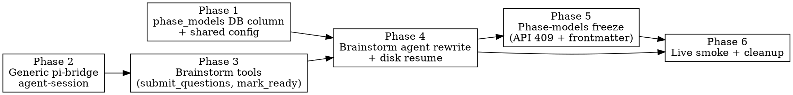

# Plan: Brainstorm — real pi-coding-agent integration

> **Source:** `docs/superpowers/specs/2026-05-09-brainstorm-real-pi-design.md`
> **Created:** 2026-05-09
> **Status:** planning

## Goal

Replace the scripted brainstorm mock with a real `@earendil-works/pi-coding-agent` session that asks structured questions, authors `design.md` and `spec.md` itself, and resumes from disk across orchestrator restarts — while introducing a phase-agnostic pi-bridge that future phases (plan, code, verify) can adopt one at a time.

## Acceptance Criteria

- [ ] `packages/pi-bridge` exposes a generic `createAgentSession(opts)` that wraps the real SDK and is consumable by any phase.
- [ ] Brainstorm runs end-to-end against a real Anthropic key (manual `PI_LIVE=1` smoke test passes).
- [ ] Brainstorm survives orchestrator restart mid-session via `pi-session.jsonl` resume.
- [ ] `tasks.phase_models` JSONB column exists; orchestrator merges with `DEFAULT_PHASE_MODELS` per dispatch; column is read-only after first run (HTTP 409).
- [ ] `mark_ready` contract check rejects incomplete artifacts with a structured error the agent can act on.
- [ ] `submit_questions` produces dashboard QuestionCards via the existing `BrainstormEventBus` — no dashboard changes required.
- [ ] Plan, code, verify, pr phases continue to work unchanged (regression-free).
- [ ] All existing orchestrator + dashboard tests still pass.

## Codebase Context

### Existing patterns to follow

- **Phase agent shape:** `apps/orchestrator/src/agents/code.ts:42` — `runPhase(opts)` taking `{ taskId, cwd, createSession, ... }` and returning `{ ok, costUsd, inputTokens, outputTokens, error? }`. The new brainstorm follows this contract.
- **Bridge adapter injection:** `packages/pi-bridge/src/_mock.ts` — `PiSdkAdapter` interface lets tests inject a fake SDK. The new `agent-session.ts` keeps the same injection pattern so unit tests don't hit the network.
- **Dual-write event bus:** `apps/orchestrator/src/agents/brainstorm-event-bus.ts:50` — JSONL-first, then EventStore. The new tools call `bus.publish(...)` exactly as the script does today; the bus contract does not change.
- **Artifact store:** `apps/orchestrator/src/agents/artifacts-store.ts` — already mediates filesystem reads/writes for `design.md` / `spec.md`. The `mark_ready` tool reads through this for the contract check.
- **One-shot subagents (separate concern):** `packages/pi-bridge/src/subagent.ts` — shells out to `pi --mode json` for fire-and-forget vendored subagents (plan-fanout research, future phases). This stays untouched; it's a different mode of pi usage.

### Key constraints discovered during exploration

- **`session.prompt()` returns `Promise<void>`** in the real SDK. Token usage and cost arrive only via `agent_end` event listeners. The bridge must aggregate. The existing mocked `PiSession.prompt()` returns `{ finalText, costUsd, ... }` — that shape stays for the unmigrated phases (plan/code) and lives only in `packages/pi-bridge/src/session.ts` (legacy). The new generic session lives in `agent-session.ts` and uses the correct event-driven shape.
- **Custom tools use TypeBox**, not Zod. Two tiny tool schemas — write them in TypeBox by hand. Zod stays for our shared types and event payloads.
- **`terminate: true`** is the SDK's mechanism for ending a turn from a tool handler. Tested condition: every finalized tool result in the batch must terminate. Since `submit_questions` and `mark_ready` are each called individually (the system prompt instructs the agent to call one and stop), this is straightforward.
- **`SessionManager.open(path)`** takes an absolute file path and persists subsequent state to it. We pass `<worktree>/.harness/<taskId>/pi-session.jsonl` so co-location with our own JSONL is preserved.
- **`createCodingTools(cwd)`** (factory) must be used when overriding `cwd` — the pre-built `readTool`/`writeTool` exports default to `process.cwd()`. Brainstorm passes `createCodingTools(worktreePath).filter(...)` to drop `bash` and `edit`.

### Test infrastructure

- **Vitest** in both `apps/orchestrator` (`pool: forks, singleFork: true, fileParallelism: false` — DO NOT change) and `packages/pi-bridge`.
- **Fake adapters:** `_mock.ts` defines the SDK adapter interface. New `FakeAgentSdkAdapter` in pi-bridge tests pushes a hand-driven event sequence; brainstorm orchestrator integration tests reuse it via `phaseDeps` injection.
- **Run command:** `pnpm test`, or per-package: `pnpm --filter @pi-harness/pi-bridge test` / `pnpm --filter @pi-harness/orchestrator test`.

## Phase Graph

Phase 1 and Phase 2 are independent (DB schema vs. bridge code) and can run in parallel if dispatched to two sessions. Phase 3 waits on 2; Phase 4 waits on 1+3; Phase 5 and Phase 6 both wait on 4 and can themselves run in parallel.

## Out of scope (deliberate)

These are documented in the spec as deferred:

- Intake form UI for editing per-phase model config (split per project rule 1; brainstorm runs against defaults).
- Migrating plan/code/verify/pr to the new bridge (each gets its own slice).
- Dashboard surfacing of pi `thinking_delta` events.
- Path-allowlisting on the `read` tool (current decision: no constraint).
- Replacing the `runSubagent` (one-shot `pi --mode json`) path used by plan-fanout.
