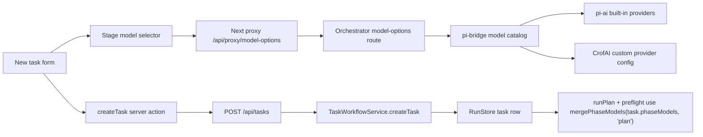
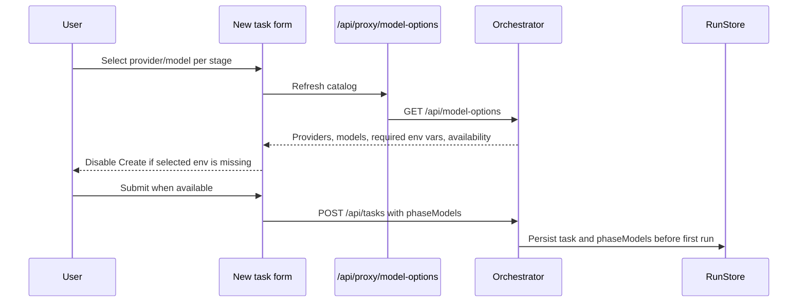

# Stage Provider/Model Selection — Design

## Problem Statement
Users can only use hard-coded per-phase model defaults unless they patch a task after creation. The new task page needs an explicit, usable way to choose the provider and model for brainstorm, planning, coder, verify, and PR before any workflow run starts. If a selected provider lacks the required credential, task creation must be blocked in the UI with a clear warning and a refresh control that rechecks environment state without clearing the user's form input.

## Context
The repository already has `Task.phaseModels`, `DEFAULT_PHASE_MODELS`, `mergePhaseModels()`, and a `PATCH /api/tasks/:id` path that freezes model edits after the first run. Agent drivers read merged phase model config from the task. The planning phase also passes the same `phaseModel` into plan preflight subagents and the claim verifier, so creation-time plan overrides naturally apply to those pre-plan agents.

Pi integration is in `packages/pi-bridge/`. The installed SDK is `@earendil-works/pi-coding-agent@0.74.0`. Its docs show built-in models come from `@earendil-works/pi-ai`, custom providers are registered through `ModelRegistry.registerProvider()`, and provider auth is resolved from configured environment variables or OAuth credentials. This codebase registers CrofAI as a runtime custom provider with `CROFAI_API_KEY`.

## Requirements
### Functional Requirements
- F1: The new task page SHALL expose provider/model controls for `brainstorm`, `plan`, `code`, `verify`, and `pr`.
- F2: The controls SHALL include pi built-in providers/models and custom providers defined in this codebase.
- F3: The selected `plan` phase provider/model SHALL be the value persisted for the plan phase so plan preflight subagents use it through existing `runPlan()` plumbing.
- F4: Task creation SHALL persist selected phase model overrides atomically with the task row.
- F5: If any selected provider requires a missing env var, the Create task button SHALL be disabled.
- F6: The warning SHALL identify the missing env var(s) and ask the user to add them first.
- F7: The warning SHALL include a refresh button that refetches credential state without resetting title, description, tags, priority, or selected model controls.

### Non-Functional Requirements
- NF1: Provider/model metadata SHALL be served by the orchestrator so dashboard and runtime validation share the same source of truth.
- NF2: The UI SHALL follow the current dark, compact card/form theme and avoid new palette drift.
- NF3: The catalog endpoint SHALL not expose secret values, only provider/model metadata and boolean availability.
- NF4: The implementation SHALL keep schema boundaries explicit with Zod and strict TypeScript types.

### Edge Cases and Boundary Conditions
- E1: If a provider has no models, it is omitted from selectable options.
- E2: If a selected provider disappears after refresh, the control falls back to the first available provider/model for that phase without clearing unrelated input.
- E3: If a selected model disappears after refresh, the model falls back to the provider's first model.
- E4: If a provider uses OAuth instead of env vars, the catalog marks it unavailable with a login warning instead of inventing an env var.
- E5: If the catalog fetch fails, the task form stays filled and the submit button is blocked until a successful refresh.
- E6: If JavaScript is bypassed, the backend still validates the create payload shape; runtime auth checks remain the hard execution gate.

## Key Insights
- The planner preflight requirement does not need a separate data model: preflight already receives `opts.phaseModel`, so storing the plan override on task creation is enough.
- The dashboard should not duplicate Pi's built-in model list manually. It should consume a server-side catalog derived from `@earendil-works/pi-ai` plus `pi-bridge` custom providers.
- Credential checks must return metadata only; exposing key values would create a new secret leak.

## Architectural Challenges
- The provider list spans two domains: pi built-ins and code-owned custom providers. A small pi-bridge catalog function keeps that knowledge beside the SDK integration.
- Server actions cannot provide a smooth refresh interaction by themselves. A client component should own the selector state and fetch `/api/proxy/model-options`.
- Creation-time persistence must preserve the existing freeze semantics: overrides are set before the first run, and later edits still go through the existing frozen patch path.

## Approaches Considered
### Approach A: Hard-code Options in the Dashboard
Fast to build, but it drifts from Pi's provider registry and would not include custom providers reliably.

### Approach B: Orchestrator Catalog Endpoint
Add a typed endpoint that returns provider/model metadata and credential availability derived from pi-bridge. The dashboard renders that catalog and posts selected `phaseModels` during task creation.

### Approach C: Let Users Type Provider and Model Strings
Minimal UI, but easy to mistype, no discoverability, and no way to preempt missing env vars.

## Chosen Approach
Use Approach B. It reuses runtime integration knowledge, keeps secrets server-side, and gives the dashboard enough structured data to provide safe controls and warnings.

## High-Level Design

## External Dependencies & Fallback Chain
None — pure-internal feature. The design uses already-installed Pi packages and existing Next/Fastify infrastructure.

## Open Questions
None blocking.

## Risks and Mitigations
- Risk: A provider credential appears in the response. Mitigation: return only env var names and booleans, never values.
- Risk: Built-in OAuth providers confuse an env-var-only warning. Mitigation: model credential kind explicitly and render an OAuth login warning separately.
- Risk: The form loses typed content on refresh. Mitigation: refresh happens inside a client component that updates only catalog state.

## Assumptions
- The phrase "modal" means model selection; code uses the established `model` terminology.
- Code-owned custom providers currently means CrofAI, which is the custom provider registered in `packages/pi-bridge`.
