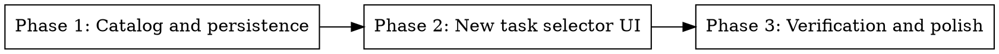

# Plan: Stage Provider/Model Selection

> **Source:** docs/spec/add-stage-provider-model-selection/spec.md
> **Created:** 2026-05-30
> **Status:** in-progress

## Goal

Let users choose provider/model per workflow phase on the new task page, block creation when selected credentials are missing, and persist those choices before the first run.

## Acceptance Criteria

- [ ] `/api/model-options` exposes built-in Pi providers/models plus CrofAI with credential metadata and no secret values.
- [ ] `POST /api/tasks` accepts and persists creation-time `phaseModels`.
- [ ] `/tasks/new` renders five phase controls and disables creation when selected credentials are unavailable.
- [ ] Refreshing credential state preserves task inputs and selected controls.
- [ ] Plan phase overrides continue to flow into plan preflight agents.
- [ ] Targeted tests, typecheck, and browser verification pass.

## Codebase Context

### Existing Patterns to Follow
- **Phase model config:** `packages/shared/src/config/phase-models.ts` owns phase keys, defaults, thinking levels, and merge semantics.
- **Pi SDK integration:** `packages/pi-bridge/src/agent-session.ts` already derives built-in providers from `@earendil-works/pi-ai` and registers CrofAI through `ModelRegistry.registerProvider()`.
- **Task creation:** `apps/orchestrator/src/http/routes/tasks.ts`, `apps/orchestrator/src/services/task-workflow-service.ts`, and `apps/orchestrator/src/adapters/run-store.ts` form the create path.
- **Dashboard proxy:** `apps/dashboard/app/api/proxy/[...path]/route.ts` forwards client refresh calls to orchestrator without a new dashboard-specific backend surface.
- **New task form styling:** `apps/dashboard/app/tasks/new/page.tsx` uses compact fields inside one bordered `bg-card` form.

### Test Infrastructure
- Unit/integration: Vitest through `pnpm --filter <workspace> test`.
- Dashboard components: Testing Library with happy-dom in `apps/dashboard/test/components`.
- Browser verification: Playwright MCP against local `pnpm dev` once implemented.
- Baseline already passed: `pnpm typecheck`, `pnpm test`.

## Phase Graph

## Phases

### Phase 1: Catalog and Persistence
Add the pi-bridge model catalog, orchestrator route, and creation-time `phaseModels` persistence.

### Phase 2: New Task Selector UI
Build a client selector component, wire it into the new task page and server action, and preserve inputs during refresh.

### Phase 3: Verification and Polish
Add focused tests, run quality commands, and verify the visible workflow in a browser.
