# Plan: General Codebase Chat

> **Source:** [spec.md](./spec.md) · [design.md](./design.md)
> **Visual contract:** [`docs/mocks/general-chat-v2-2026-05-30.html`](../../mocks/general-chat-v2-2026-05-30.html) — the approved mock. Every UI phase below builds against it; component tests and Playwright proofs are measured against its scenarios (Empty / Streaming / Tool-heavy / Stopped / Error + the model & thinking pickers + responsive).
> **Created:** 2026-05-30
> **Status:** planning

## Goal

Add a ChatGPT/Claude-style, repo-scoped chat page to the dashboard that streams an agent's response in real time over SSE (built on `pi-bridge`'s `createAgentSession`), renders collapsible thinking and tool calls, supports mid-stream termination, persists thread history, and lets the user choose the provider/model and thinking level — all matching the existing Linear-style theme and the approved mock.

## Acceptance Criteria

- [ ] `/chat` and `/chat/[threadId]` routes render; a "Chat" link appears in `topbar-nav`. (REQ-001)
- [ ] Submitting a message streams the assistant reply token-by-token with a live cursor. (REQ-010..013)
- [ ] Thinking renders in a collapsible block; tool calls render with running → ok/err states. (REQ-020..023)
- [ ] The user can stop a streaming turn; partial text is preserved with a "stopped" notice. (REQ-030..032)
- [ ] A grouped, searchable model picker and a thinking-level picker update the thread's selection. (REQ-040..044)
- [ ] Threads + messages persist across an orchestrator restart. (REQ-050)
- [ ] Reconnect resumes by sequence without duplicate rendering; auth errors surface as error frames. (REQ-051, REQ-052)
- [ ] The VS-0 CrofAI probe still passes at verification.
- [ ] No regression: baseline 169 dashboard tests stay green; new tests cover every REQ/EDGE per the matrix.

## Codebase Context

### Existing Patterns to Follow
- **SSE route**: `apps/orchestrator/src/http/routes/live.ts` — headers, `id:`/`event:`/`data:` frames, 25s heartbeat, `last-event-id` resume via `listAfter`, `req.raw.on("close")` cleanup.
- **Store + JSONL + subscribers**: `apps/orchestrator/src/adapters/live-event-store.ts` (subscribe/publish/listAfter, monotonic sequence) + `adapters/jsonl-writer.ts` (`appendJsonl`/`readJsonl`). State under `<stateDir>/store/`.
- **Agent turn driver**: `apps/orchestrator/src/agents/brainstorm.ts` lines ~203-381 — `createAgentSession({model, thinkingLevel, systemPrompt, onEvent})`, switch on `PiBridgeEvent.kind`, `AbortSignal` → `session.abort()`, fire-and-forget persistence.
- **Route registration**: `apps/orchestrator/src/http/server.ts` — `registerXRoutes(app, deps)` with optional deps spread; add `registerChatRoutes`.
- **Zod validation**: `Schema.parse(req.body)` → `ValidationError` (see `routes/brainstorm.ts`).
- **Shared types**: `packages/shared/src/types/live-event.ts` — `XByKind` map + `Envelope<K extends Kind>` generic, `readonly` everywhere, `kind` discriminator, `ts: Date` in memory. `PiBridgeEvent` in `packages/pi-bridge/src/agent-session.ts` maps 1:1 to chat frames.
- **SSE proxy**: `apps/dashboard/app/api/live/stream/route.ts` (passthrough body, `x-accel-buffering: no`, 503 on transient) + generic `app/api/proxy/[...path]/route.ts`.
- **Client stream**: `apps/dashboard/lib/live-event-client.ts` (`buildLiveStreamUrl`, `parseLiveEnvelope`, `mergeLiveEnvelopes` dedupe-by-id+sort-by-sequence) + `lib/use-events.ts` + `lib/run-live-provider.tsx`.
- **Data layer**: `lib/api/index.ts` (`api({baseUrl,fetch})` + `send<T>` + hydrators), `lib/client/queries.ts` (`queryKeys`, `queries`, `mutations`, proxied client), `lib/server/api.ts` (RSC direct + mock fallback).
- **Dropdown**: `apps/dashboard/components/new-task/priority-picker.tsx` — click-away (`mousedown`), Escape, `aria-haspopup="listbox"`/`role="option"`, absolute + z-index.
- **Collapsible**: `components/task-detail/agent-log.tsx` — `useState<Set<string>>`, chevron toggle, `aria-expanded`.
- **Theme tokens**: `apps/dashboard/app/globals.css` `@theme` — `--color-*`, `--font-*`, `.markdown-body`, `.cursor`, `.pulse-dot`, `.no-scrollbar`. Mock already uses these verbatim.

### Test Infrastructure
- **Unit/component**: Vitest + happy-dom + Testing Library. `MockEventSource` pattern in `test/components/mission-command-live.test.tsx` (static `instances[]`, `emit()`). `createTestStores()` in orchestrator `test/helpers/stores.ts`. Mock `createAgentSession` with `vi.fn()`.
- **no-placeholders rule**: `test/no-placeholders.test.ts` forbids TODO/placeholder/lorem/dummy/fake/TBD in source — all UI copy must be real.
- **E2E**: `apps/dashboard/playwright.config.ts` auto-starts orchestrator (4000) + dashboard (3000); `data-testid` selectors; API setup via `apiRequest.newContext`.
- **Run commands**: `pnpm --filter @pi-harness/shared --filter @pi-harness/pi-bridge build` (prereq), then `pnpm --filter @pi-harness/dashboard test`, `pnpm --filter @pi-harness/orchestrator test`, `pnpm --filter @pi-harness/dashboard test:e2e`.

## Phase Graph

```dot
digraph phases {
  rankdir=LR
  node [shape=box]

  phase_1 [label="Phase 1: Shared chat types"]
  phase_2 [label="Phase 2: Orchestrator store + turn driver"]
  phase_3 [label="Phase 3: Orchestrator HTTP routes (REST + SSE)"]
  phase_4 [label="Phase 4: Dashboard data layer + SSE proxy + stream hook"]
  phase_5 [label="Phase 5: Chat UI components (mock-matched)"]
  phase_6 [label="Phase 6: Route wiring, nav, live provider"]
  phase_7 [label="Phase 7: E2E + verification polish"]

  phase_1 -> phase_2 -> phase_3 -> phase_4
  phase_1 -> phase_5
  phase_4 -> phase_6
  phase_5 -> phase_6
  phase_6 -> phase_7
}
```

Phase 1 unblocks both the backend chain (2→3→4) and the UI (5). Phase 5 (pure presentational components, props-driven) is independent of the backend and can run in parallel with Phases 2–4 once types exist. Phase 6 integrates everything; Phase 7 proves it end-to-end.

## Phases

1. **Shared chat types** — `ChatStreamFrame` union, `ChatThread`, `ChatMessage`, `ChatMessagePart`, `ChatModelSelection`, `ChatThinkingLevel`; the contract for everything else.
2. **Orchestrator store + turn driver** — `ChatSessionStore` (threads/messages/frames, JSONL, sequence, subscribe) + `chat-session.ts` driver translating `PiBridgeEvent` → `ChatStreamFrame`, with abort.
3. **Orchestrator HTTP routes** — `registerChatRoutes`: create/list/get thread, post message (starts turn), SSE stream, stop.
4. **Dashboard data layer + proxy + stream hook** — chat API methods, `queryKeys`/`queries`/`mutations`, `app/api/chat/stream` proxy, `useChatStream` hook + frame reducer.
5. **Chat UI components** — `chat-rail`, `chat-transcript`, `chat-message`, `chat-thinking`, `chat-tool-call`, `chat-composer`, `model-picker`, `thinking-picker`, empty/stopped/error states — matching the mock.
6. **Route wiring + nav + live provider** — `/chat` + `/chat/[threadId]` pages, `chat-live-provider`, "Chat" nav entry, end-to-end assembly.
7. **E2E + verification polish** — Playwright streaming/stop/model-switch specs; re-run VS-0 probe; responsive + a11y pass.
